# 💰 Exes — Smart Expense Tracker

<div>


A modern, offline-first Expense Tracker built with Flutter using Material 3, SQLite and a clean modular architecture.

</div>

---

## 📱 About

Exes is a personal finance application that helps users manage daily income and expenses while providing insightful analytics through interactive charts.

The application focuses on:

* Fast transaction management
* Beautiful Material 3 UI
* Offline-first architecture
* Powerful search & filtering
* Financial analytics
* Clean and scalable codebase

---

# ✨ Features

## 💵 Transaction Management

* Add Income & Expense
* Edit existing transactions
* Delete transactions
* Undo Delete using SnackBar
* Notes support
* Category selection
* Date selection

---

## 🔍 Smart Search

Search transactions by

* Category
* Note
* Amount

Highlighted matching text improves readability.

---

## 🎯 Advanced Filters

Filter transactions by

* Transaction Type
* Category
* Amount Range
* Date Range
* Sorting

Sorting Options

* Date (Newest First)
* Date (Oldest First)
* Amount (High → Low)
* Amount (Low → High)
* Category (A → Z)
* Category (Z → A)

Active filters are displayed as removable chips.

---

## 📊 Analytics Dashboard

Interactive charts built using **fl_chart**

Includes

* Income vs Expense Bar Chart
* Expense Distribution Pie Chart
* Daily Spending Trend Line Chart
* Time Filters

    * Daily
    * Weekly
    * Monthly
    * Yearly

---

## ⚙ Settings

* Theme Switching
* Currency Selection
* Date Format
* Default Analytics Filter

---

## 📁 Import / Export

Supports

* JSON Export
* JSON Import
* CSV Export

All data remains on the user's device.

---

## 🔐 Privacy

* Offline First
* No Login Required
* No Cloud Storage
* No User Tracking
* No Advertisements

---

# 🎨 UI Highlights

* Material 3 Design
* Light Theme
* Dark Theme
* Responsive Layout
* Smooth Bottom Sheets
* Custom Splash Screen
* Adaptive Launcher Icons
* Animated Charts
* Beautiful Cards
* Floating Action Button
* Search Highlighting
* Sticky Active Filter Chips

---

# 🧠 Technical Highlights

✔ SQLite Database

✔ Provider State Management

✔ Modular Folder Structure

✔ Reusable Widgets

✔ Material 3 Theming

✔ SearchDelegate Implementation

✔ Advanced SQL Filtering

✔ Undo Delete using SnackBar

✔ Bottom Sheet Forms

✔ Interactive Charts

✔ Theme Management

---

# 🏗 Project Structure

```text
lib/
│
├── database/
│
├── models/
│
├── screens/
│
├── services/
│
├── theme/
│
├── widgets/
│
├── utils/
│
└── main.dart
```

Each layer has a single responsibility which keeps the application scalable and maintainable.

---

# 🗄 Database

SQLite

Main Table

ExpenseTransaction

| Field    | Type     |
|----------|----------|
| id       | Integer  |
| amount   | Double   |
| category | String   |
| type     | String   |
| note     | String   |
| date     | DateTime |

---

# 📦 Packages Used

* provider
* sqflite
* path
* intl
* fl_chart
* csv
* share_plus
* file_picker
* path_provider
* in_app_review

---

## 📸 Screenshots

### Splash Screen
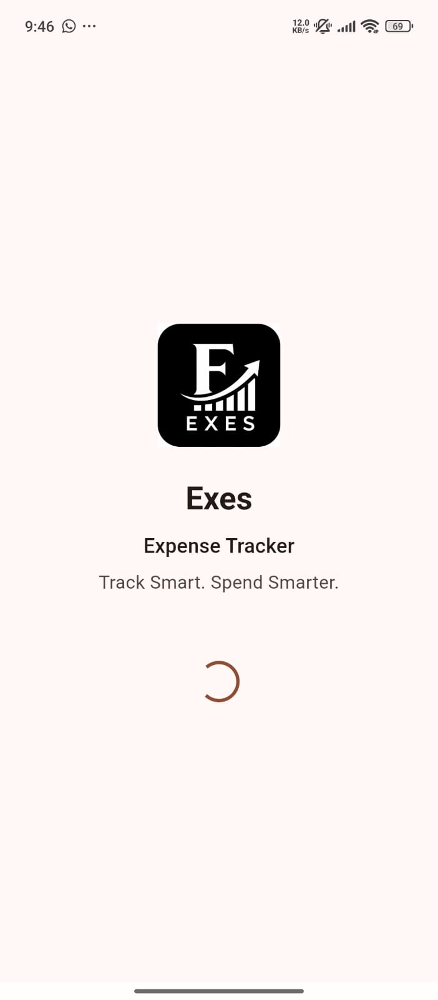

**App launch screen with Exes branding before loading user data.**

---

### Home Dashboard
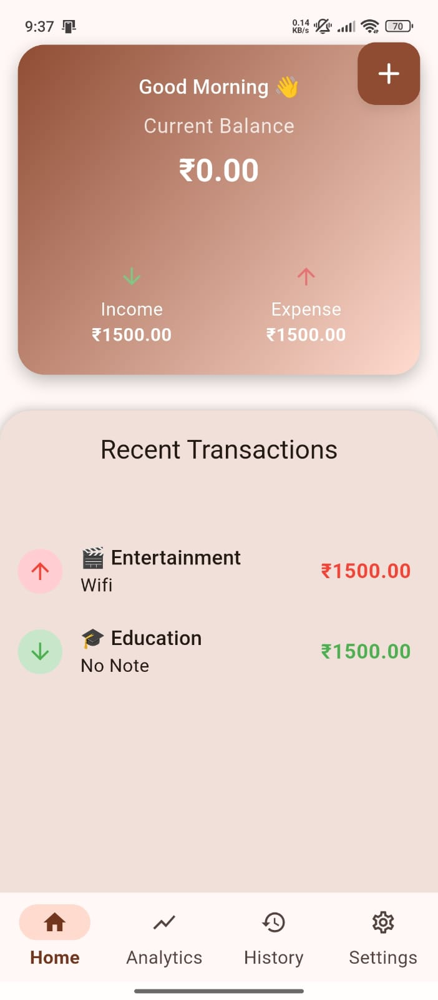

**Overview of current balance, income, expenses, and recent transactions with Material 3 design.**

---

### Add Transaction
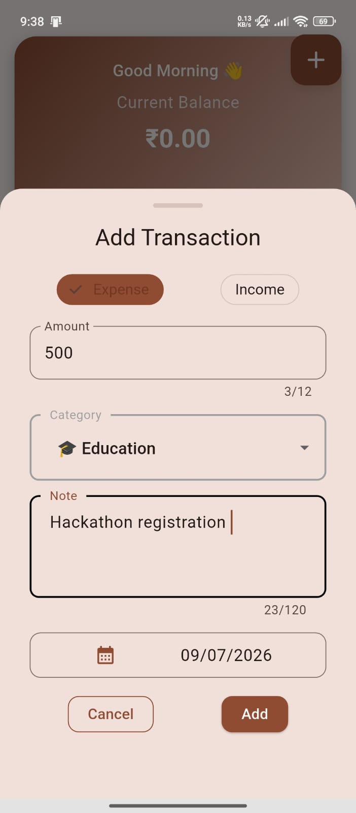

**Bottom sheet for adding or editing transactions with validation, category selection, date picker, and responsive form controls.**

---

### Analytics Dashboard
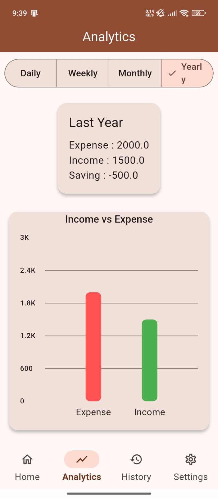

**Interactive financial analytics featuring bar charts, pie charts, trend analysis, and selectable time periods.**

---

### Transaction History
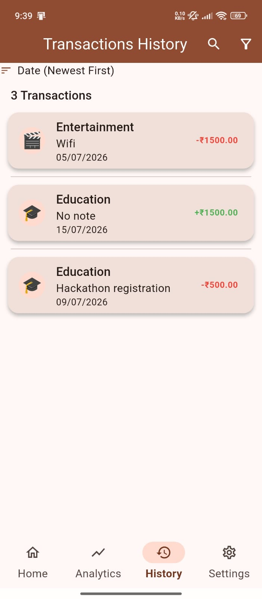

**Complete transaction history with swipe-to-delete, undo action, sorting, and categorized expense records.**

---

### Smart Search
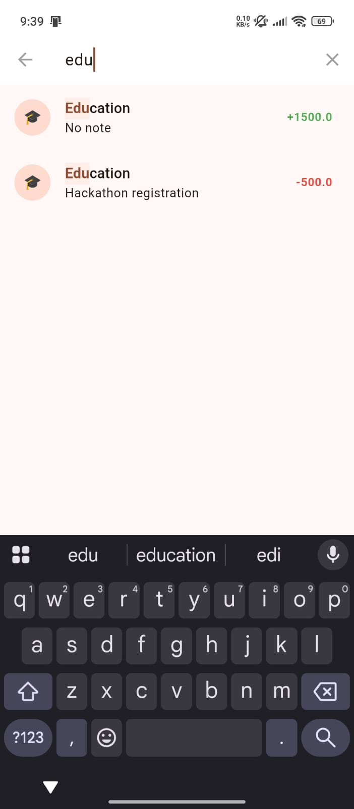

**Real-time search with highlighted matching text across category, notes, and transaction amount.**

---

### Advanced Filters
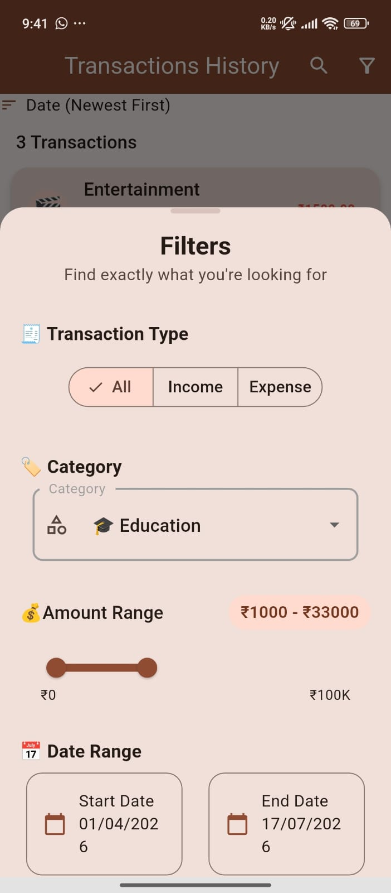

**Filter transactions using transaction type, category, amount range, date range, and sorting options.**

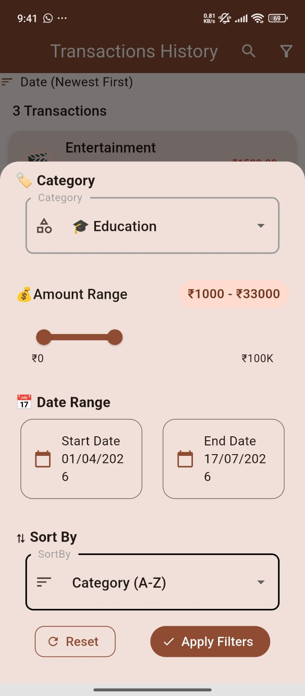

**Modern Material 3 filter interface with intuitive controls for precise transaction filtering.**

---

### Active Filter Chips
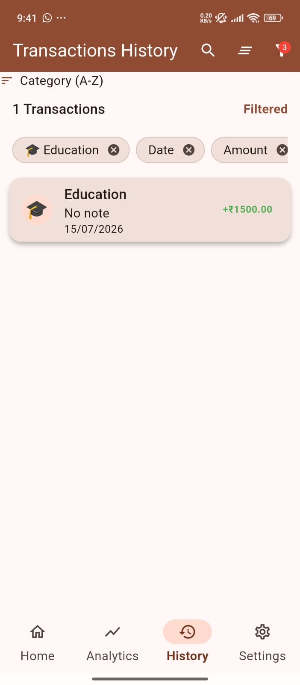

**Applied filters displayed as removable chips for quick modification without reopening the filter panel.**

---

### Settings
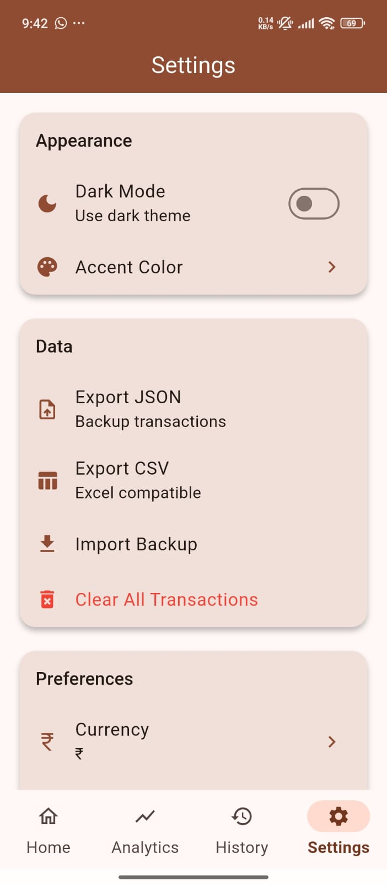

**Application settings including theme mode, accent colors, currency, date format, analytics preferences, import/export, and privacy options.**

---

### Theme Customization
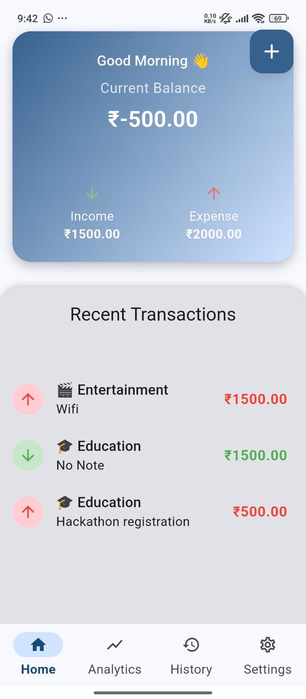

**Dynamic Material 3 color theming with customizable accent colors applied throughout the application.**

---

### Dark Mode
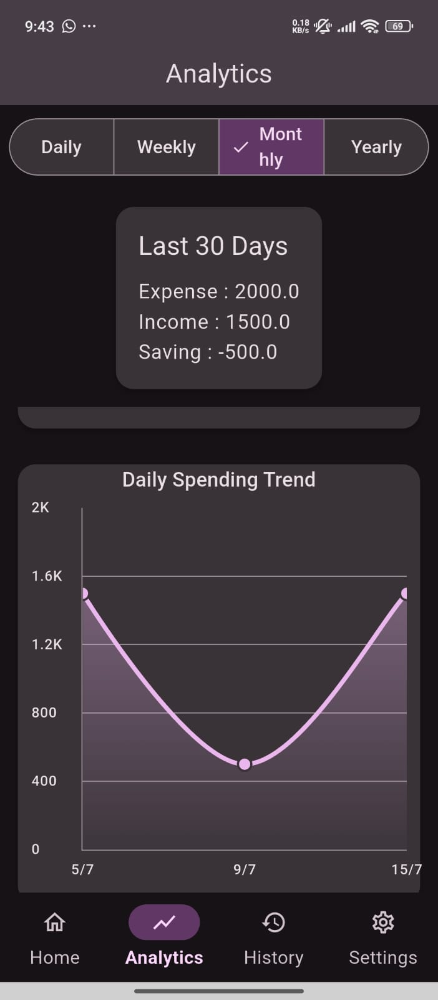

**Fully optimized dark theme with adaptive charts, cards, and Material 3 color system.**

---

## 🎥 Demo

Coming Soon (GIF or screen recording)

> A short 30-second demo will be added showcasing:
> - Adding a transaction
> - Editing a transaction
> - Swipe to delete with Undo
> - Search
> - Advanced Filters
> - Analytics
> - Theme switching

---

# 🚀 Getting Started

Clone the repository

```bash
git clone https://github.com/ANUJK0004/exes.git
```

Install dependencies

```bash
flutter pub get
```

Run

```bash
flutter run
```

---

# 💡 Challenges Solved

* Modular architecture
* Dynamic theme support
* SQLite filtering
* SearchDelegate with highlighted text
* Advanced filtering system
* Interactive analytics dashboard
* Material 3 migration
* Import/Export support

---

# 📈 Future Roadmap

* Google Drive Backup
* Undo delete functionality
* Cloud Sync
* Budget Planning
* Recurring Transactions
* Notifications
* PIN / Biometrics
* AI Spending Insights
* Multi-language Support
* Multi-Currency Exchange
* Monthly Financial Reports

---
